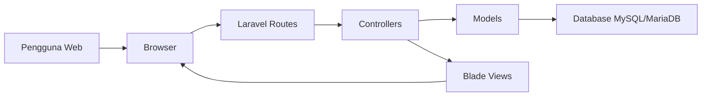
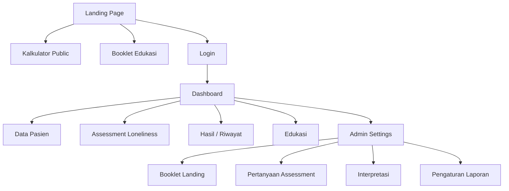
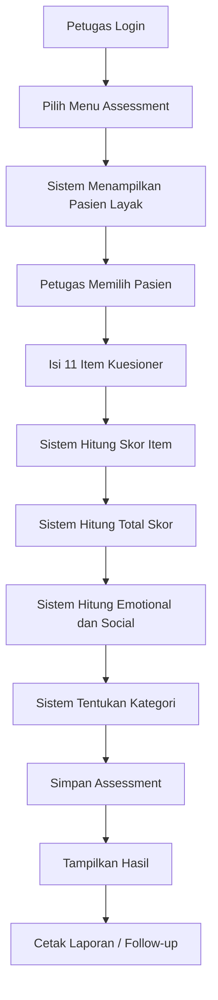
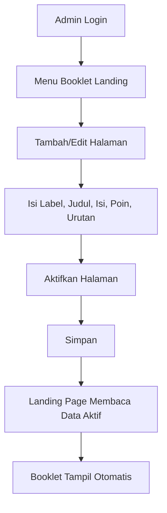

# Arsitektur dan Alur Sistem

## 1. Ringkasan Arsitektur

Aplikasi menggunakan arsitektur web berbasis Laravel dengan pola MVC.

Komponen utama:

- Browser pengguna
- Laravel route
- Controller
- Model
- Blade view
- Database MySQL/MariaDB
- Server/VPS

## 2. Diagram Arsitektur

## 3. Modul Utama

## 4. Alur Public

1. Pengunjung membuka landing page.
2. Pengunjung membaca informasi web.
3. Pengunjung dapat membuka booklet edukasi.
4. Pengunjung dapat mencoba kalkulator public.
5. Hasil kalkulator tampil di browser dan tidak disimpan ke database.
6. Petugas dapat klik login untuk masuk dashboard.

## 5. Alur Login

1. Pengguna membuka halaman login.
2. Pengguna memasukkan email dan password.
3. Sistem memvalidasi akun.
4. Jika valid, pengguna diarahkan ke dashboard.
5. Menu dashboard menyesuaikan role.

## 6. Alur Assessment

## 7. Alur Booklet Admin

## 8. Alur Data

| Proses | Input | Output |
|---|---|---|
| Login | Email, password | Session pengguna |
| Data pasien | Identitas dan kondisi pasien | Data pasien tersimpan |
| Assessment | Jawaban 11 item | Skor, kategori, interpretasi |
| Kalkulator public | Jawaban 11 item | Hasil edukatif tanpa simpan |
| Booklet admin | Judul, isi, poin, status | Halaman booklet landing |
| Laporan | Data assessment | Tampilan cetak/PDF |

## 9. Role dan Akses

| Menu | Admin | Perawat/Petugas | Keluarga | Public |
|---|---|---|---|---|
| Landing | Ya | Ya | Ya | Ya |
| Kalkulator public | Ya | Ya | Ya | Ya |
| Login | Ya | Ya | Ya | Tidak perlu |
| Dashboard | Ya | Ya | Terbatas | Tidak |
| Data pasien | Ya | Ya | Tidak | Tidak |
| Assessment | Ya | Ya | Tidak | Tidak |
| Hasil assessment | Ya | Ya | Terbatas | Tidak |
| Edukasi perawat | Ya | Ya | Tidak | Tidak |
| Edukasi keluarga | Ya | Ya | Ya | Tidak |
| Pengaturan admin | Ya | Tidak | Tidak | Tidak |
| Booklet admin | Ya | Tidak | Tidak | Tidak |

## 10. Catatan Desain

Tampilan dibuat dengan pendekatan:

- Profesional dan tenang untuk konteks kesehatan.
- Tidak terlalu ramai.
- Public page cukup menarik untuk pasien/keluarga/pengunjung.
- Dashboard lebih fokus pada kerja petugas.
- Konten booklet dibuat ringkas agar nyaman dibaca di desktop dan HP.
