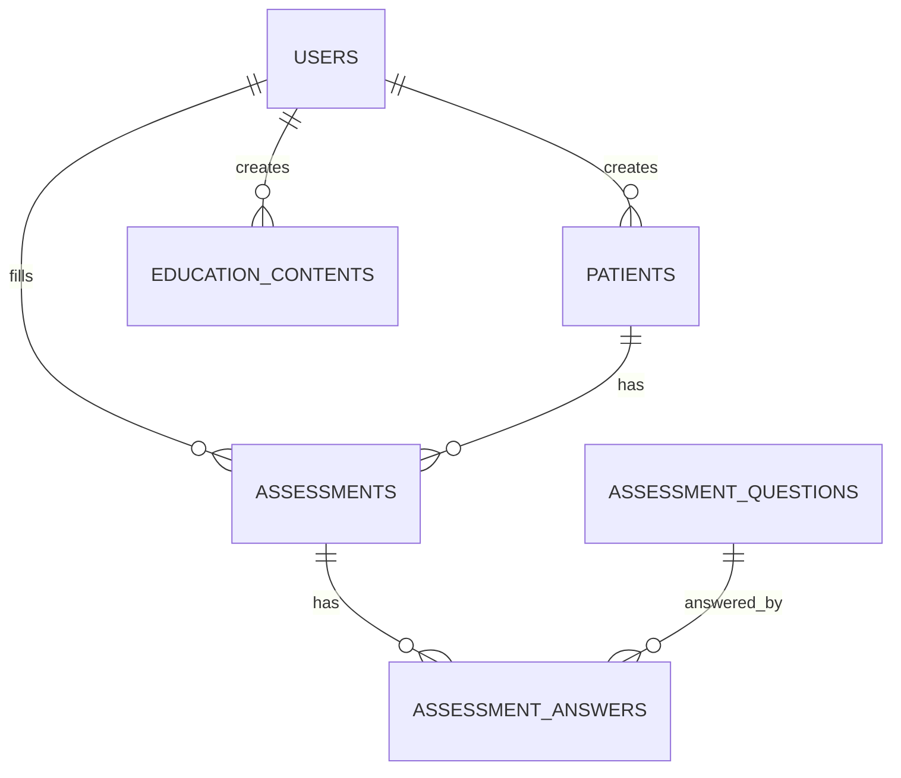

# Skema Database

## 1. Ringkasan

Database digunakan untuk menyimpan pengguna, pasien, pertanyaan assessment, hasil assessment, jawaban assessment, konten edukasi, pengaturan public/laporan, dan halaman booklet.

## 2. Tabel Utama

### 2.1 `users`

Menyimpan akun pengguna sistem.

| Kolom | Keterangan |
|---|---|
| id | Primary key |
| name | Nama pengguna |
| email | Email unik |
| password | Password terenkripsi |
| role | Role pengguna, default perawat |
| unit_kerja | Unit kerja pengguna |
| is_active | Status aktif akun |
| remember_token | Token login |
| timestamps | Waktu dibuat/diubah |

### 2.2 `patients`

Menyimpan data pasien ICU.

| Kolom | Keterangan |
|---|---|
| id | Primary key |
| kode_pasien | Kode pasien unik |
| nama_inisial | Inisial pasien |
| usia | Usia pasien |
| jenis_kelamin | Laki-laki/Perempuan |
| tanggal_masuk_icu | Tanggal masuk ICU |
| diagnosis_medis_utama | Diagnosis utama |
| status_kesadaran | Status kesadaran |
| kemampuan_komunikasi | Kemampuan komunikasi |
| nama_perawat_pengisi | Nama perawat pengisi |
| tanggal_pengisian | Tanggal pengisian data |
| sadar | Kriteria sadar |
| mampu_berkomunikasi | Kriteria komunikasi |
| memahami_pertanyaan | Kriteria pemahaman |
| bersedia_assessment | Kriteria persetujuan |
| created_by | User pembuat data |
| timestamps | Waktu dibuat/diubah |

### 2.3 `assessment_questions`

Menyimpan pertanyaan assessment.

| Kolom | Keterangan |
|---|---|
| id | Primary key |
| question_text | Teks pertanyaan |
| sort_order | Urutan pertanyaan |
| is_active | Status aktif |
| timestamps | Waktu dibuat/diubah |

### 2.4 `assessments`

Menyimpan hasil assessment utama.

| Kolom | Keterangan |
|---|---|
| id | Primary key |
| patient_id | Relasi ke pasien |
| user_id | Petugas pengisi |
| assessment_date | Tanggal assessment |
| total_score | Total skor loneliness |
| category | Kategori umum |
| interpretation | Interpretasi |
| nursing_recommendation | Rekomendasi perawat |
| family_education_recommendation | Rekomendasi keluarga |
| notes | Catatan |
| timestamps | Waktu dibuat/diubah |

### 2.5 `assessment_answers`

Menyimpan jawaban per item assessment.

| Kolom | Keterangan |
|---|---|
| id | Primary key |
| assessment_id | Relasi ke assessment |
| assessment_question_id | Relasi ke pertanyaan |
| answer_text | Jawaban terpilih |
| score | Skor item |
| timestamps | Waktu dibuat/diubah |

### 2.6 `education_contents`

Menyimpan materi edukasi.

| Kolom | Keterangan |
|---|---|
| id | Primary key |
| title | Judul materi |
| target | Target: perawat/keluarga |
| category | Kategori materi |
| content | Isi materi |
| status | draft/published |
| created_by | User pembuat |
| timestamps | Waktu dibuat/diubah |

### 2.7 `site_settings`

Menyimpan pengaturan teks public dan laporan.

| Kolom | Keterangan |
|---|---|
| id | Primary key |
| setting_key | Nama key pengaturan |
| setting_value | Nilai pengaturan |
| timestamps | Waktu dibuat/diubah |

### 2.8 `booklet_pages`

Menyimpan halaman booklet landing.

| Kolom | Keterangan |
|---|---|
| id | Primary key |
| kicker | Label halaman |
| title | Judul halaman |
| body | Isi singkat |
| points | Poin halaman dalam format JSON |
| sort_order | Urutan halaman |
| is_active | Status tampil di landing |
| timestamps | Waktu dibuat/diubah |

## 3. Relasi Utama

## 4. Catatan Skoring

Skor emotional/social tidak disimpan sebagai kolom khusus pada tabel `assessments` pada tahap ini. Nilai dimensi dihitung dari jawaban berdasarkan urutan item De Jong Gierveld:

- Emotional: item 2, 3, 5, 6, 9, 10.
- Social: item 1, 4, 7, 8, 11.

Jika dibutuhkan pelaporan statistik lanjutan, dapat ditambahkan kolom khusus seperti:

- emotional_score
- social_score
- dominant_dimension

## 5. Tabel Sistem Laravel

Tabel bawaan Laravel:

- `sessions`
- `cache`
- `cache_locks`
- `jobs`
- `job_batches`
- `failed_jobs`
- `password_reset_tokens`
- `migrations`

Tabel tersebut mendukung session, cache, queue, reset password, dan pencatatan migration.
